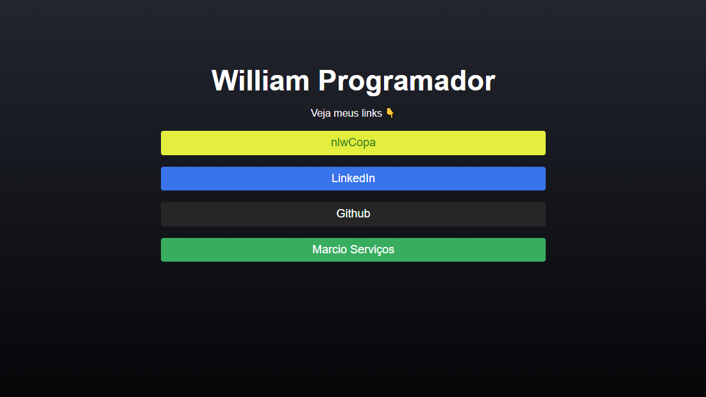

<h1 align="center">
    DevLinks 🚀
</h1> 

Foi um projeto desenvolvido na semana do ReactJS do Sujeito programador

<h1 align="center">
  
</h1>

### 🛠 Tecnologias

As seguintes ferramentas foram usadas na construção do projeto:

- React
- Firebase (autenticação e firestore)

 
  Este projeto consiste na exibição de links, onde apenas poderá cadastrar seus links quem estiver logado.    
  Nesse sistema a conta já esta pré-definida no firebase, sendo uma aplicação mais privada.

### Projeto hospedado no netlify

<h2 href="https://devlinkreact.netlify.app/" >Projeto</h2>
